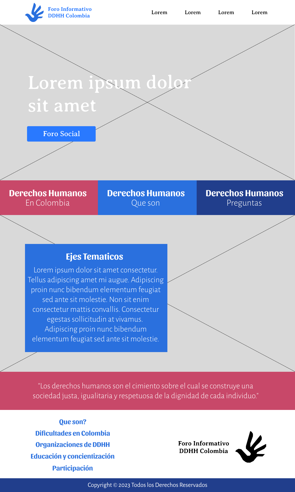
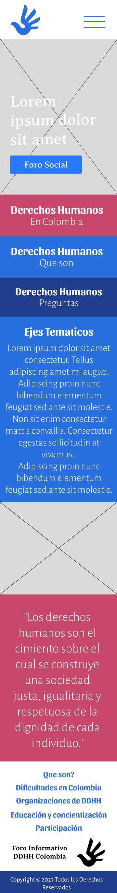

## Autores

- [Violeta Villamizar Acuña](https://github.com/violetavillamizara)
- [Jaider Steeven Mendoza Cardona](https://github.com/Dabrox02)
- [Johan Sebastian Pachon Mojica](https://github.com/violetavillamizara)

# DERECHOS HUMANOS

    <i>Promoción de los Derechos Humanos en Colombia: Fomento de la Paz, Búsqueda de la Verdad y Garantía de Justicia </i>

### Situacion Problema

Los derechos humanos son los cimientos sobre los cuales se construye una sociedad justa, equitativa y respetuosa. Son inherentes a todos los seres humanos, sin importar su origen, género, orientación sexual, raza, religión o cualquier otra característica. Los derechos humanos engloban una serie de principios y libertades que buscan proteger la dignidad y el bienestar de cada individuo, permitiéndoles vivir una vida plena y libre de opresión. Estos derechos abarcan desde los fundamentales, como el derecho a la vida y a la libertad, hasta los derechos sociales, culturales y económicos que aseguran una calidad de vida adecuada.

En Colombia, como en muchos otros países, la promoción y protección de los derechos humanos ha sido una tarea constante y a menudo desafiante. A lo largo de su historia, Colombia ha experimentado conflictos armados, desplazamiento forzado y desafíos socioeconómicos que han afectado la realización plena de los derechos, contribuyendo a la vulneración de la libertad de expresión y propiciando la propagación de desinformación e ignorancia entre la población colombiana.

Como parte integral de la solución, se presenta un foro social en formato web que incluye tanto una sección de preguntas y respuestas como un espacio informativo. Este foro tiene como objetivo fundamental, asegurar el derecho universal a la información, ofreciendo un acceso libre y sencillo para cualquier persona interesada.

### Objetivo

Crear un foro social web que ofrezca informacion ordenada y confiable sobre los Derechos Humanos, y que al mismo tiempo esté disponible de manera gratuita para una comunidad receptiva, empleando tecnologías web como HTML, CSS, junto con un framework de estilos como Bootstrap y el enfoque de diseño Bloque, Elemento, Modificador (BEM). Con el fin de crear una pagina web solida, util y accesible, que aporte una solución tanto para la población colombiana como para individuos en áreas afectadas por conflictos y carencia de autoridades locales.

### Estado del Arte

Dentro de las soluciones y propuestas planteadas a esta problematica, encontramos algunas que ofrecen informacion por medio de conferencias, cursos, noticias y posts sobre cultura, convivencia y derechos humanos, se encuentran las siguientes:

- [Foro de Asociaciones de Educacion en Derechos Humanos y por la Paez](https://foroderechoshumanos.org/el-foro/)
- [Foro Mundial de Derechos Humanos 2023 (FMDH23)](https://fmdh23.org/)
- [Human Rights Watch](https://www.hrw.org/es/world-report/2019/country-chapters/colombia)
- [Naciones Unidas Derechos Humanos Oficina Del Alto Comisionado](https://www.ohchr.org/es/ohchr_homepage)
- [Naciones Unidas](https://www.un.org/es/)
 

 #### Que son los Derechos Humanos?
 Los derechos humanos son principios que salvaguardan la dignidad de cada individuo. Estas normas orientan cómo las personas interactúan en sociedad y entre sí, así como las interacciones entre los ciudadanos y el Estado, incluyendo las responsabilidades que el Estado tiene hacia sus ciudadanos.

 Fuente: [UNICEF](https://www.unicef.org/es/convencion-derechos-nino/que-son-derechos-humanos)

 #### Dificultades en Colombia
 En el presente, a pesar de algunos avances, la situación de los derechos humanos sigue siendo preocupante en Colombia. Los defensores de los derechos humanos, especialmente aquellos que protegen la tierra y el medio ambiente, enfrentan agresiones y amenazas. Los excombatientes de las FARC-EP también son víctimas de asesinatos y amenazas. Los medios de comunicación y la libertad de expresión están en peligro debido a ataques constantes. Hay informes de uso excesivo de la fuerza por parte de las autoridades estatales.

 Fuente: 
- [EL PAÍS DONDE QUEREMOS VIVIR](https://www.es.amnesty.org/en-que-estamos/paises/pais/show/colombia/)
- [El Alto Comisionado para los Derechos Humanos optimista y esperanzado con el futuro de Colombia](https://news.un.org/es/story/2023/01/1518162)
- [Relator Especial sobre los defensores de los derechos humanos](https://www.ohchr.org/es/special-procedures/sr-human-rights-defenders/)

 #### Organizaciones de Derechos Humanos
 Los Estados tienen la responsabilidad de respetar, proteger y cumplir los derechos humanos de todas las personas dentro de su jurisdicción. Las organizaciones internacionales, como las Naciones Unidas, y las organizaciones no gubernamentales también desempeñan un papel importante en la promoción y protección de los derechos humanos en todo el mundo.

 Fuente: 
 - [Misión de Verificación de las Naciones Unidas en Colombia (UNVMC)](https://colombia.unmissions.org/en)

 - [Comisión Interamericana de Derechos Humanos (CIDH)](https://www.oas.org/es/cidh/default.asp)
 
 - [Instituto Popular de Capacitación (IPC)](https://landportal.org/es/organization/instituto-popular-de-capacitaci%C3%B3n)
 
 - [Asociación Nacional de Usuarios Campesinos de Colombia (ANUC)](https://www.unidadvictimas.gov.co/es/asociacion-nacional-de-usuarios-campesinos-de-colombia-anuc/14153)

 #### Educacion y Concientización
 La enseñanza de los derechos humanos desempeña un papel esencial en la resolución de las raíces de las violaciones de esos derechos. Tiene el propósito de capacitar a las personas, especialmente a aquellas que han sufrido abusos, para que demanden un completo respeto por los derechos humanos.

 Fuente: [Educacion y concientizacion](https://www.es.amnesty.org/en-que-estamos/temas/educacion-en-derechos-humanos/)

#### Participacion DDHH

Un foro social se erige como un poderoso catalizador para impulsar la participación y el compromiso en el ámbito de los Derechos Humanos. Al brindar un espacio inclusivo y abierto a la información, este tipo de plataforma fomenta el interes por los DDHH.

El acceso a información diversa nutren el aprendizaje continuo. Los participantes pueden ampliar su horizonte, adquirir nuevos conocimientos y descubrir enfoques innovadores para abordar desafíos relacionados con la justicia social y la igualdad.

En última instancia, un foro social fomenta la participación, creando una comunidad virtual activa a traves de la formulación de preguntas, con el fin sensibilizar y llegar a la acción colectiva, este tipo de plataforma se convierte en un agente impulsor de cambio, contribuyendo a la promoción y protección de los Derechos Humanos en Colombia y tambien en el Mundo.

 Fuente: [Foro sobre los Derechos Humanos, la Democracia y el Estado de Derecho](https://www.ohchr.org/es/hrc-subsidiaries/democracy-forum#:~:text=El%20Foro%20sobre%20los%20Derechos,de%20todos%20a%20la%20justicia.)

## Diseño

La maquetación del sitio web sobre derechos humanos debe ser visualmente atractiva y evocadora. Utilizando colores suaves y tonos neutros como base puede transmitir seriedad y respeto, mientras que toques de colores vibrantes pueden resaltar elementos importantes como llamadas a la acción o aspectos clave de los derechos humanos.
 
#### Colores Principales

    

#### Tipografias
La legibilidad y el estilo de las fuentes influyen en la experiencia del usuario y en la comunicación efectiva de la información. Las tipografías adecuadas pueden transmitir la seriedad y la autoridad necesarias para un tema tan importante como los derechos humanos.

Las tipografias para la maquetacion web fueron:

    

#### Imagotipo
El diseño del logo debe ser memorable, significativo y capaz de comunicar los valores esenciales de los derechos humanos de manera instantánea.

    

## Secciones de la Página
### Inicio
En el inicio se dara una breve introduccion sobre los ejes tematicos de la pagina, con imagenes alusivas a los derechos humanos y el desarrollo de la convivencia social, tendra algunos textos que promuevan los derechos humanos y una breve frase alusiva a los derechos humanos. Finalmente en la parte inferior, el imagotipo de la pagina junto con un indice a otras secciones mas informativas de la pagina y un pie de pagina con los derechos de autor.

##### Version Desktop

    

##### Version Mobile

    

### Temas de Interes.
Sección de interés e información, aquí nos redirigimos desde el inicio de la página, una estructura muy sencilla y clara con una imágen alusiva y un texto conciso al tema a tratar, al final de la página se invita a acceder al foro social.

##### Version Desktop

    

##### Version Mobile

    

### Foro Social
En este espacio, se lleva a cabo el proceso de retroalimentación en relación a las consultas de la comunidad. Se incorpora una nueva sección que tiene como propósito incentivar la participación en nuestro foro, animando a los usuarios a formular preguntas acerca de Derechos Humanos. Además, al final de la seccion todas las preguntas planteadas en formato desplegable con sus respectivas respuestas.

##### Version Desktop

    

##### Version Mobile

    

### Formulario de Preguntas
Una manera de hacer tus preguntas muy sencilla, el formulario consta de solo tres datos para realizar tu pregunta: Nombre, Apellido y tu pregunta. Y en la parte inferior una seccion que invita a visitar el foro social con las preguntas de otros usuarios.

##### Version Desktop

    

##### Version Mobile

    

### Tecnologias Utilizadas
En la creación de nuestro proyecto, se aprovecho una combinación de tecnologías esenciales con el fin de darle vida al proyecto. Las cuales fueron:

1. **HTML** (HyperText Markup Language)
2. **CSS** (Cascading Style Sheets)
3. **Bootstrap**